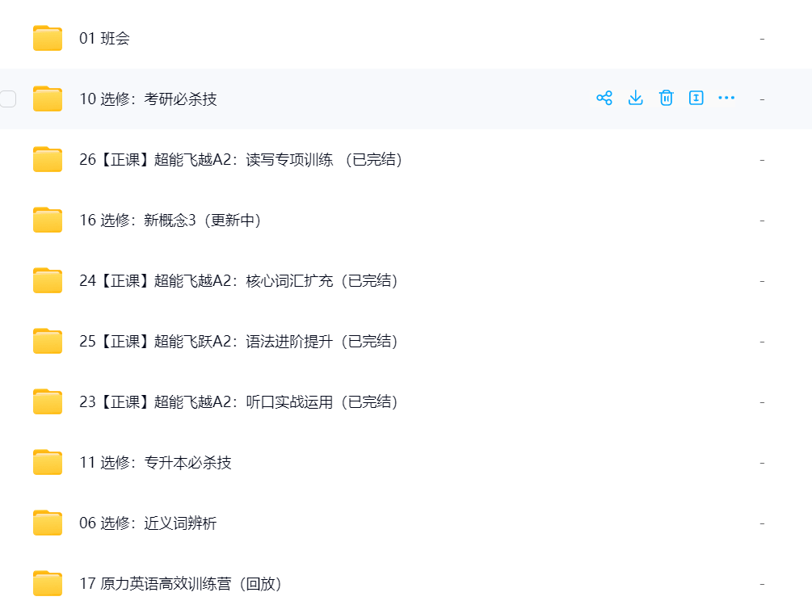

# 艾力英语百度网盘分享

今天一下课，大家突然闻到了屁味，英语老师：Who did this？ please stand up! 班长站了起来，英语老师：Who asked you to stand up boy? 班长：It’s none of your business！ English teacher！全班爆笑，当时我们也庆幸班长的英语没学好啊！

学习英语是一个需要耐心和持续努力的过程。以下是一些有效的方法：

1. **基础学习**：首先，要掌握基本的语法规则、词汇和常用短语。可以通过课本、在线课程或语言学习应用来学习。
2. **听力练习**：多听英语材料，如英文歌曲、电影、电视剧、播客和新闻。这有助于提高你的听力理解能力和语感。
3. **口语练习**：尽量多说英语，可以找语言交换伙伴或参加英语角。不要害怕犯错，大胆开口是提高口语的关键。
4. **阅读**：阅读英文书籍、报纸、杂志和网站，可以帮助你增加词汇量和理解力。从简单的读物开始，逐渐增加难度。
5. **写作**：练习写英文日记、作文或邮件。写作是巩固语法和词汇的好方法。可以请老师或朋友帮忙修改，指出错误。
6. **使用学习工具**：利用词典、语法书和在线资源。许多应用程序和网站提供互动学习，使学习过程更有趣。
7. **设定目标**：为自己设定具体的学习目标，如每天学习一定时间的英语，或者每周学完一个单元。
8. **坚持不懈**：学习任何语言都需要时间和持续的努力。不要因为一时的困难而放弃，坚持下去，你会看到进步。

通过结合这些方法，你可以有效地提高你的英语水平。记住，学习语言是一个渐进的过程，享受学习的乐趣很重要。

## 英语自然拼读

## 英语四六级

的资料文档

阅读文档。

联系客户咨询获取：

- 英语学习路线。
- 英语自然拼读启蒙。

分享各类教程，包括编程、各类证书考试资源等等，本网站所有教程资源均来自互联网，若涉及侵权立马删除！

